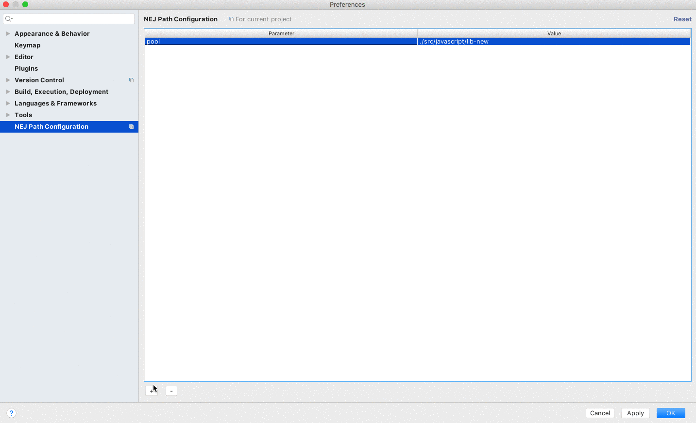
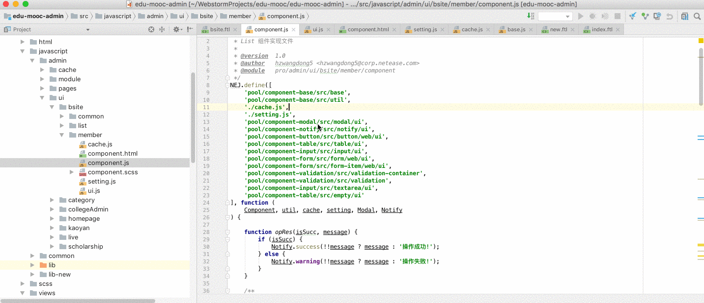
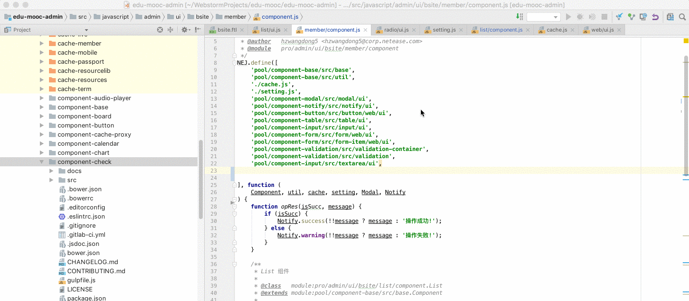

# NEJ Plugin

> happy coding with nej :smile:

## 特点

* 快速导航至依赖文件
* 智能感知路径依赖
* 多种后缀文件格式的支持，例如jsp,js,php,html,ftl

## 支持

> 如果使用上有问题，很有可能是IDE太老导致。建议升级至最新版本，不对过老的IDE版本做兼容

* [WebStorm Lastest Download](https://www.jetbrains.com/webstorm/)   
* [IntelliJ IDEA Lastest Download](https://www.jetbrains.com/idea/)

## 安装

`Plugins`搜索`NEJ Plugin`并安装即可.

## 路径变量配置

注: 

* 这里不同于[`VSC`](https://code.visualstudio.com/)，没有全局设置的入口。需要给每个工程单独进行设置。
* 导航`nej`源码，只需要配置变量名为`lib`。值为其真实的源码路径便可。可不用在实际编码中加变量前缀`lib`

## 基本使用

### 快速导航至依赖文件

### 智能感知路径依赖

## 反馈

> 使用上如果有任何疑问或者建议，可以直接`popo`戳我.
联系方式: hzwangdong5@corp.netease.com

## 感谢

* [AbnerZheng](https://github.com/AbnerZheng/NEJPlugin)

## 开源协议

[MIT](LICENSE)

